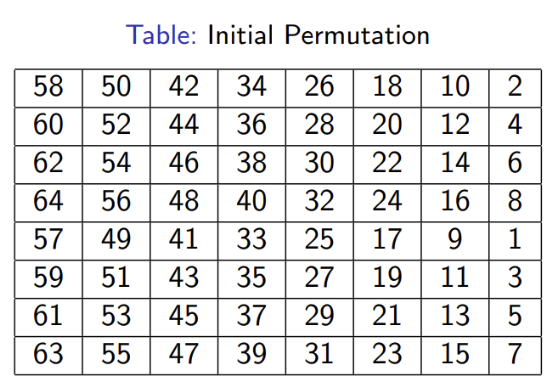

# \[Write-Up] Dreamhack - Double DES

대칭키 암호화 알고리즘 중 하나인 DES를 이용한 워게임 문제입니다. prob.py가 주어지고, exploit 코드를 만들어 flag를 얻을 수 있습니다.&#x20;


## DES&#x20;

1976년 미국 연방정보처리 표준 규격(FIPS)로 채택된 대칭키 암호 시스템입니다.&#x20;

DES의 암호화 과정은 두 개의 치환(P 박스)과 16개의 페이스텔 라운드 함수로 구성됩니다. DES는 64비트 평문을 64비트 암호문으로 암호화하며, 키의 길이는 56비트, 라운드의 수는 16입니다.&#x20;

이 때, 키의 크기는 원래 64비트이지만, 7비트마다 오류 검출을 위한 패리티비트가 들어가기 때문에 실질적인 키의 길이는 56비트가 됩니다. 또한 56비트의 키로부터 16개의 서브키가 생성되고, 각 서브키는 각 라운드에서 사용됩니다.&#x20;

<figure><figcaption><p>DES 암호화 과정</p></figcaption></figure>

56비트의 암호화 키는 라운드키 생성기(Round-key generator)에 의해 각 라운드마다 48비트의 16개 서브키가 생성됩니다. 이 서브키는 각 라운드에 라운드 키로 사용됩니다.&#x20;

1. 초기 전치 (Initial Permutation, IP)

<figure><figcaption></figcaption></figure>

64비트의 평문이 Initial Permutation 테이블을 따라 permutation 암호화가 적용됩니다.&#x20;

2. Single Round

각 라운드는 다음과 같은 구조를 가지고 있습니다.&#x20;

<figure><figcaption></figcaption></figure>

$$L(i) : R(i-1)$$

$$R(i): L(i-1) \oplus F(K(i), R(i-1))$$

3. 최종 전치 (Final Permutation, FP)&#x20;

64비트의 암호문을 Reverse Initial Permutation 테이블을 따라 각 비트 위치를 바꾸어 DES 복호화를 진행합니다.&#x20;

## prob.py&#x20;

````python
```python
#!/usr/bin/env python3
from Crypto.Cipher import DES
import signal
import os

if __name__ == "__main__":
    signal.alarm(15)

    with open("flag", "rb") as f:
        flag = f.read()
    
    key = b'Dream_' + os.urandom(4) + b'Hacker'
    key1 = key[:8]
    key2 = key[8:]
    print("4-byte Brute-forcing is easy. But can you do it in 15 seconds?")
    cipher1 = DES.new(key1, DES.MODE_ECB)
    cipher2 = DES.new(key2, DES.MODE_ECB)
    encrypt = lambda x: cipher2.encrypt(cipher1.encrypt(x))
    decrypt = lambda x: cipher1.decrypt(cipher2.decrypt(x))

    print(f"Hint for you :> {encrypt(b'DreamHack_blocks').hex()}")

    msg = bytes.fromhex(input("Send your encrypted message(hex) > "))
    if decrypt(msg) == b'give_me_the_flag':
        print(flag)
    else:
        print("Nope!")
```
````

`signal.alarm(15)`를 통해 15초의 제한 시간이 주어져 있음을 알 수 있습니다.&#x20;

파일을 연 후, key는 알려진 6바이트('Dream\_'), 미지의 4바이트, 알려진 6바이트('Hacker')로 구성되어 있습니다.&#x20;

* `os.urandom` 함수는`/dev/urandom`이 만들어내는 난수입니다.&#x20;

키의 앞 8바이트를 이용해 `key1`을 만들고, 뒤 8바이트를 이용해 `key2`를 만듭니다. `key1`과 `key2`는 모두 알려진 6바이트와 미지의 2바이트를 가지고 있습니다.&#x20;

DES를 이용해 `cipher1`과 `cipher2`암호를 생성합니다. DES는 대칭키 암호로 키를 알면 암호화와 복호화가 모두 가능하다는 특징이 있습니다. 따라서, `key1`과 `key2`의 미지의 2바이트를 알아내면 `cipher1`과 `cipher2`의 암호화와 복호화가 가능합니다.&#x20;

전체 암호화는 `cipher1`로 암호화한 후, `cipher2`로 복호화합니다. 전체 복호화는 `cipher2`로 암호화한 후, `cipher1`로 복호화합니다. 복호화 기능은 암호화 기능의 역연산이므로 순서가 바뀌어야 합니다.&#x20;

우리가 해야할 것은 `b'DreamHack_blocks'`를 암호화한 후의 결과가 주어진 상태에서, 두 키의 미지의 2바이트를 복구하는 것입니다. 따라서 `cipher2.encrypt(cipher1.encrypt(b'DreamHack_blocks'))`의 결과를 이용해 두 키를 완전히 복구하면 문제를 해결할 수 있습니다.&#x20;

## exploit.py

````python
```python
from pwn import *
from Crypto.Cipher import DES

io = process(["python3", "prob.py"])
io = remote("host3.dreamhack.games", 20135)

io.recvuntil(b":> ")
hint = bytes.fromhex(io.recvline().decode())

conflict = dict()

for i in range(65536):
    b = i.to_bytes(2, "big")
    cipher = DES.new(b"Dream_" + b, DES.MODE_ECB)
    enc = cipher.encrypt(b"DreamHack_blocks")
    conflict[enc] = b"Dream_" + b

for i in range(65536):
    b = i.to_bytes(2, "big")
    cipher = DES.new(b + b"Hacker", DES.MODE_ECB)
    dec = cipher.decrypt(hint)

    if dec in conflict: 
        key1 = conflict[dec]
        key2 = b + b"Hacker"
        break

cipher1 = DES.new(key1, DES.MODE_ECB)
cipher2 = DES.new(key2, DES.MODE_ECB)
encrypt = lambda x: cipher2.encrypt(cipher1.encrypt(x))
assert encrypt(b"DreamHack_blocks") == hint

io.sendlineafter(b'> ', encrypt(b"give_me_the_flag").hex().encode())

flag = eval(io.recvline())
io.close()

print(flag.decode())

```
````
